# IT Infrastructure & DevOps Trainee Assignment

I used an Ubuntu EC2 instance for this assignment and connected to it from WSL. The project includes a Node.js application, Nginx, PostgreSQL, Bash scripts, and a basic metrics endpoint.

## Project files

| File / folder | Purpose |
| --- | --- |
| `app/` | Node.js application and Dockerfile |
| `compose.yaml` | Configuration for the three containers |
| `nginx/` | Reverse proxy and metrics configuration |
| `scripts/` | Health check, backup, and metrics scripts |
| `configs/` | SSH configuration and cron jobs |
| `.env.example` | Example database settings |
| `screenshots/` | Screenshots of the setup and results |

## Task 1: Linux and security setup

### AWS setup

I created my VPC, public and private subnets, Internet Gateway and route table. Then I launched Ubuntu in the public subnet with a public IP and my SSH key.

**1. Creating the task-assignment VPC with the 192.168.0.0/20 range.**

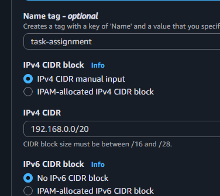

**2. Checking that my VPC was available.**

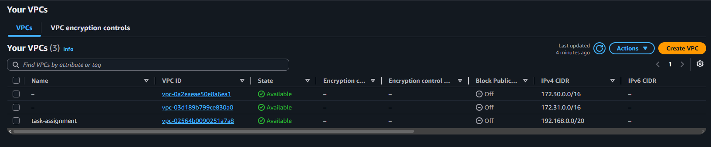

**3. Creating public and private subnets.**

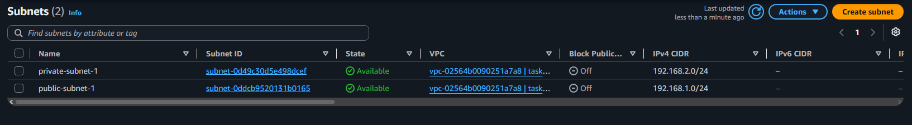

**4. Attaching task-igw to my VPC.**

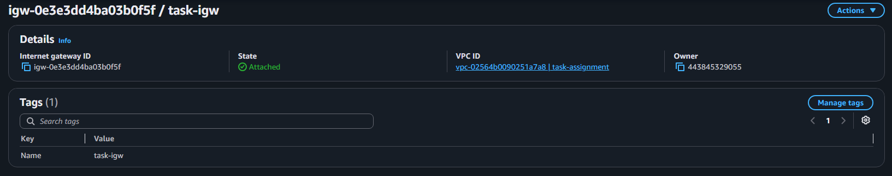

**5. Adding the default route through the Internet Gateway.**

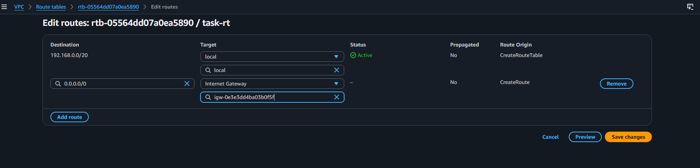

**6. Associating the route table with the public subnet.**

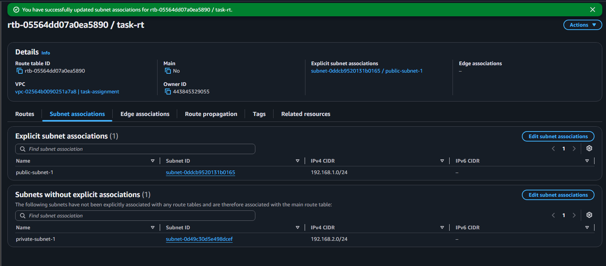

**7. Choosing Ubuntu and creating my task key pair.**

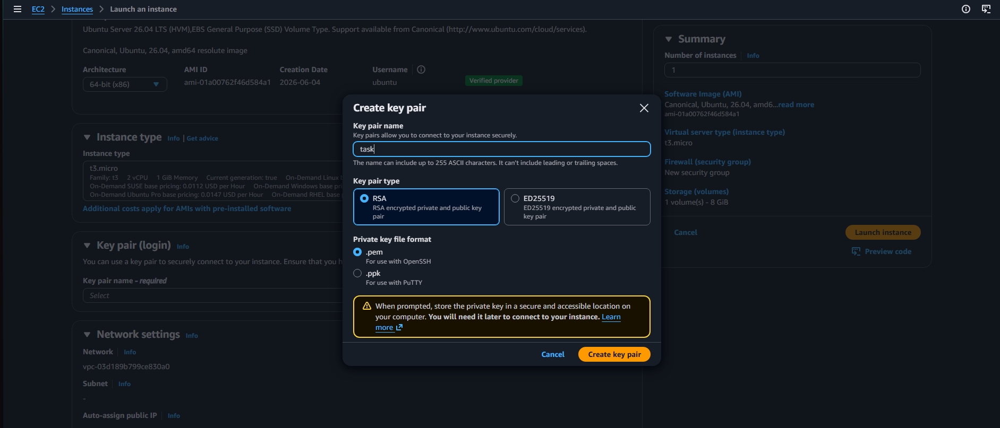

**8. Selecting the public subnet, public IP and initial SSH rule.**

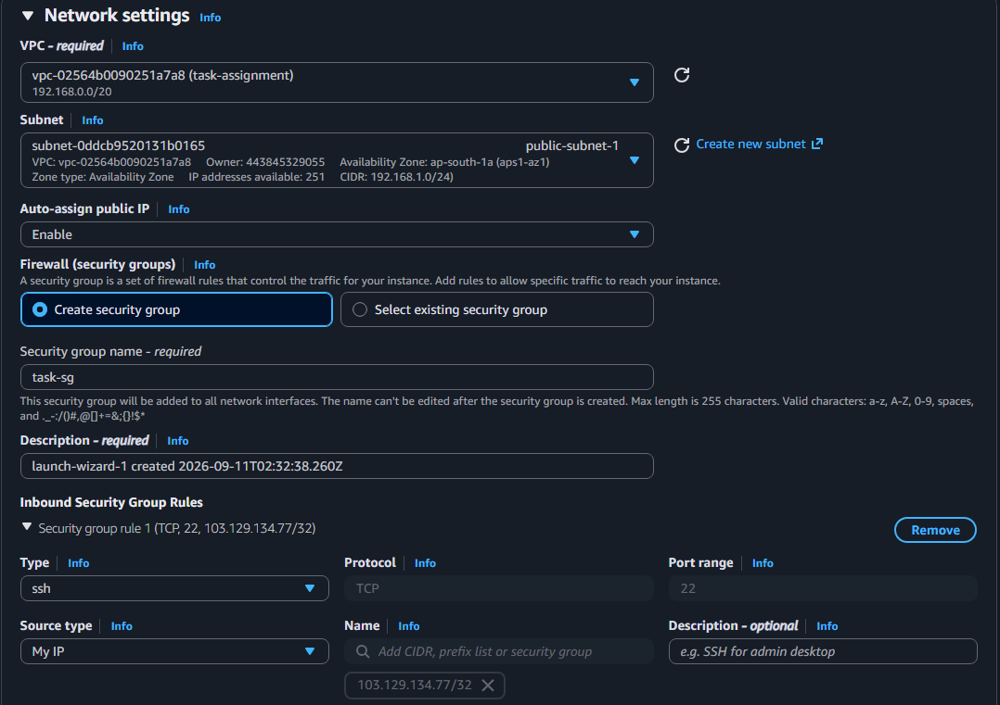

**9. Checking that my EC2 instance was running.**

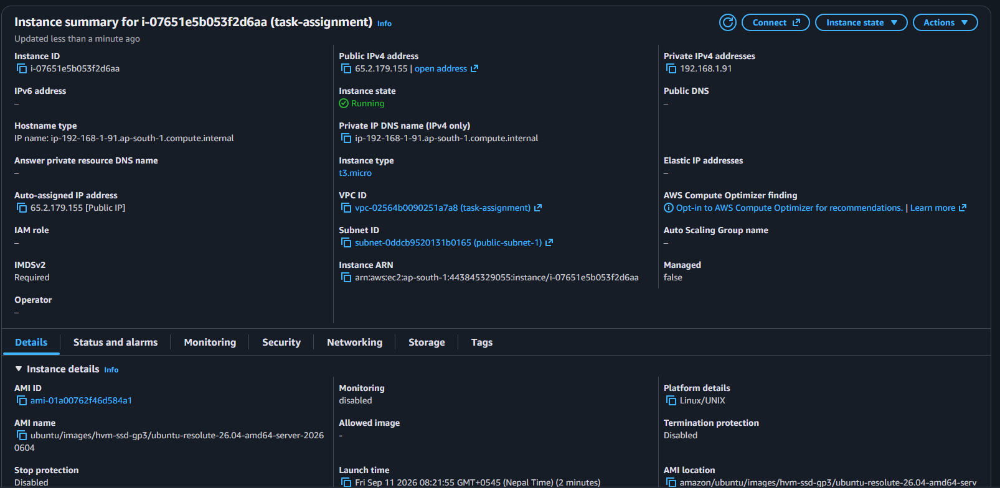

**10. Finding the SSH connection command in AWS.**

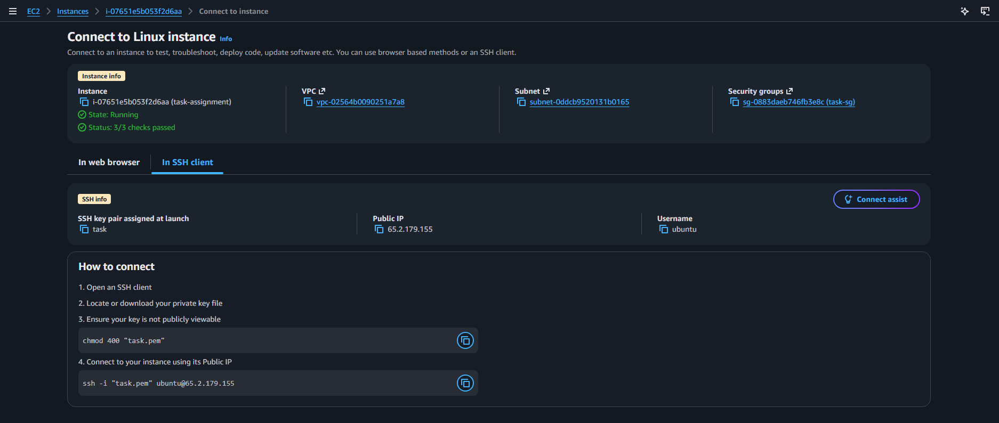

**11. My security-group rules for port 22, 2222, 80 and 443**

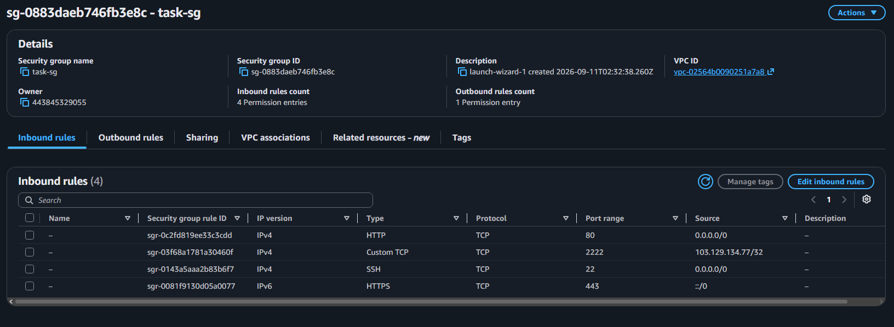

### EC2 and trainee user

Create an Ubuntu EC2 instance with a public IP and a subnet route to an Internet Gateway. Initially allow SSH port 22 from **My IP** in its security group.

Connect from WSL. Replace `SERVER_PUBLIC_IP` with your instance's public IP and use your own key filename:

```bash
chmod 400 task.pem
ssh -i task.pem ubuntu@SERVER_PUBLIC_IP
```

On EC2, install the basic tools and create the user:

```bash
sudo apt update
sudo apt install -y git curl ufw cron procps
sudo adduser trainee
sudo usermod -aG sudo trainee
sudo mkdir -p /home/trainee/.ssh
sudo cp /home/ubuntu/.ssh/authorized_keys /home/trainee/.ssh/authorized_keys
sudo chown -R trainee:trainee /home/trainee/.ssh
sudo chmod 700 /home/trainee/.ssh
sudo chmod 600 /home/trainee/.ssh/authorized_keys
```

Open another WSL terminal and connect as trainee:

```bash
ssh -i task.pem trainee@SERVER_PUBLIC_IP
```

Verify the user and download the repository:

```bash
whoami
sudo whoami
cd ~
git clone https://github.com/PrabalPiya/task-assignment.git
cd task-assignment
```

**12. Connecting from WSL using my key.**

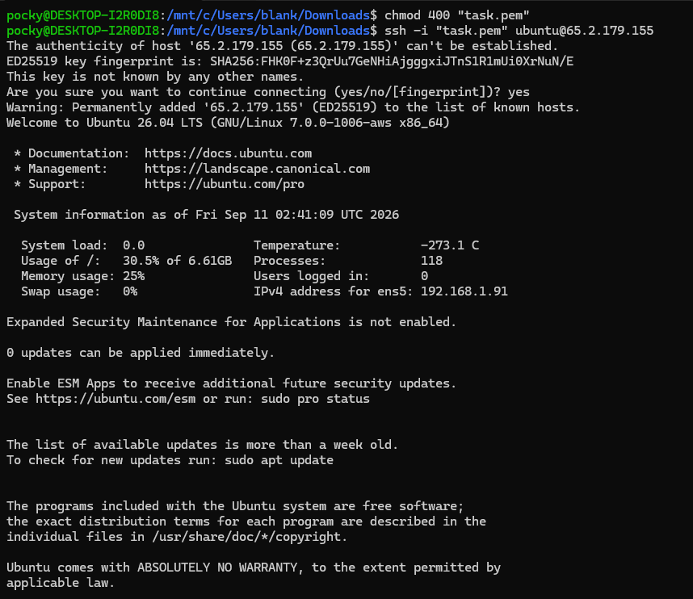

**13. Checking my user and Ubuntu version.**

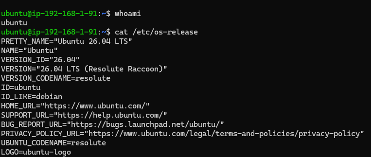

**14. Checking UFW before setup; it was inactive.**

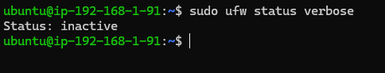

**15. Creating the trainee user.**

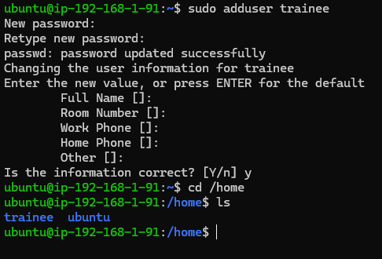

**16. Giving trainee sudo access and checking the groups.**

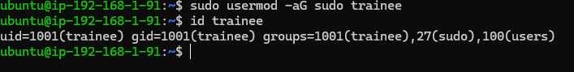

**17. Copying the SSH public key and setting permissions.**

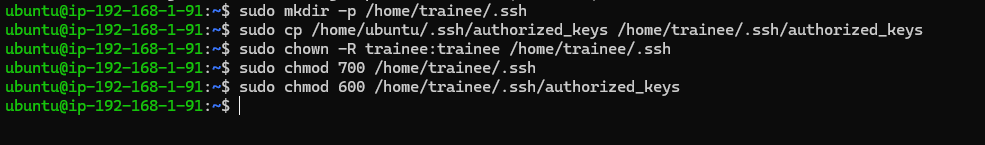

**18. Logging in as trainee and checking sudo access.**

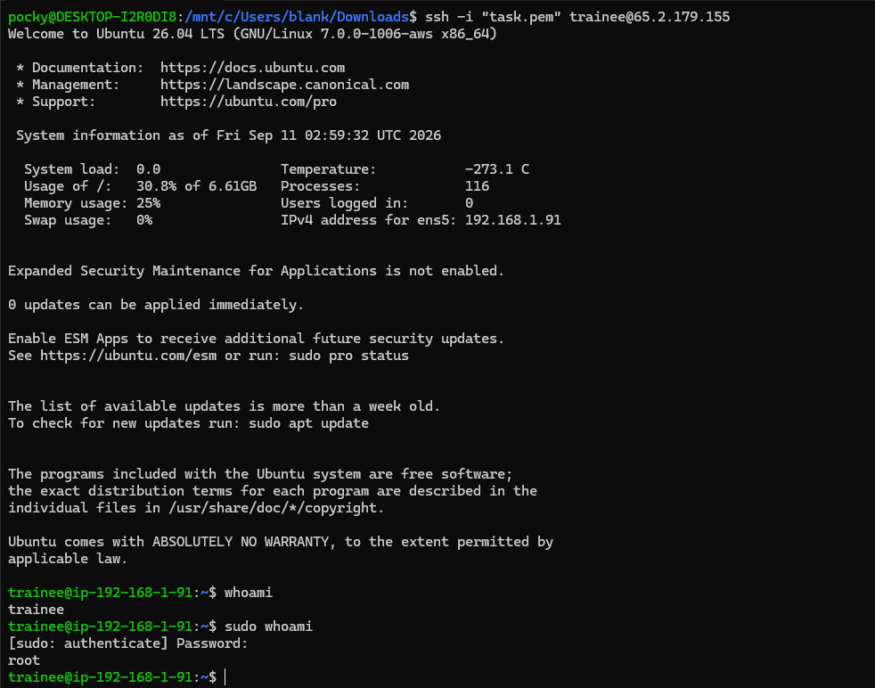

### SSH configuration

Add port **2222 from My IP** to the EC2 security group before changing SSH. Keep the current connection open until a new connection works.

```bash
sudo install -m 644 configs/00-trainee.conf /etc/ssh/sshd_config.d/00-trainee.conf
sudo sshd -t
```

The file sets SSH to port 2222, enables key authentication, and disables root login and password authentication.

```bash
sudo systemctl daemon-reload
sudo systemctl restart ssh.socket
sudo systemctl restart ssh.service
```

From a new WSL terminal, test:

```bash
ssh -p 2222 -i task.pem trainee@SERVER_PUBLIC_IP
```

After it succeeds, remove port 22 from the security group. The final IPv4 rules should be:

| Port | Source |
| --- | --- |
| 2222 | My IP |
| 80 | `0.0.0.0/0` |
| 443 | `0.0.0.0/0` |

**19. Allowing port 2222 before changing SSH.**

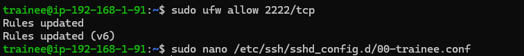

**20. Setting port 2222 and disabling root and password login.**

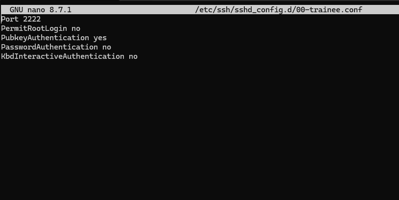

**21. Reloading systemd and restarting SSH.**

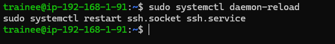

**22. Testing SSH: port 22 refused the connection and port 2222 worked.**

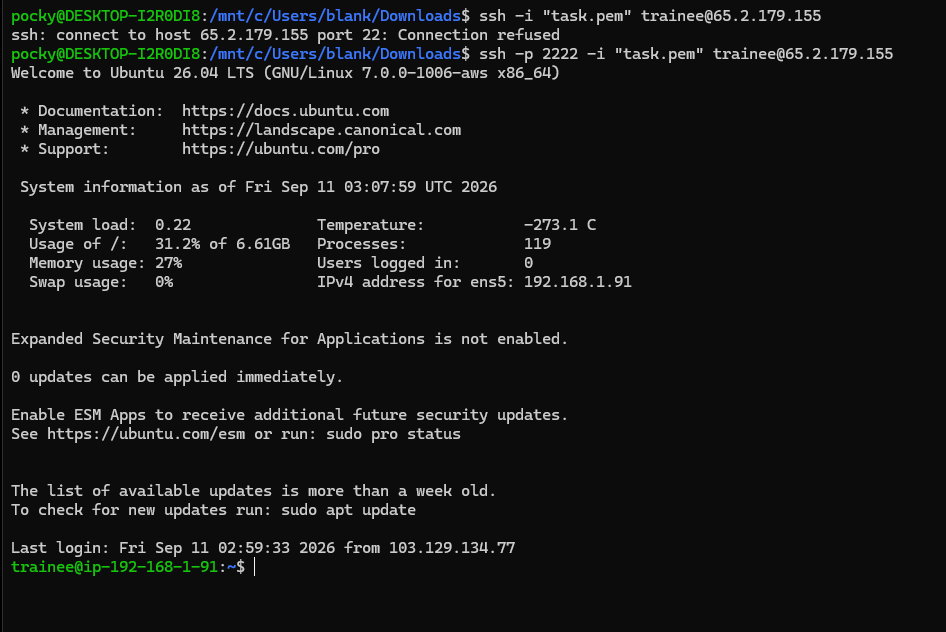

### UFW firewall

```bash
sudo ufw default deny incoming
sudo ufw default allow outgoing
sudo ufw allow 2222/tcp
sudo ufw allow 80/tcp
sudo ufw allow 443/tcp
sudo ufw enable
sudo ufw status verbose
```

UFW should be active and allow only these inbound ports. Remove any old port 22 rule if one exists. Port 443 is allowed, but this project serves the application over HTTP; HTTPS certificates are not configured.

**23. Setting UFW defaults and allowing 2222, 80 and 443.**

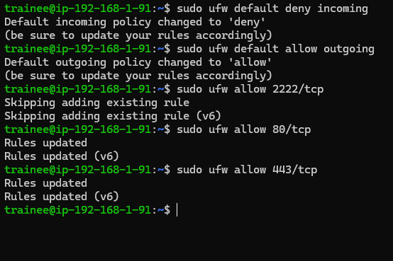

**24. Enabling UFW and checking the active rules.**

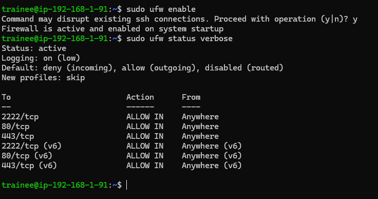

## Task 2: Docker and web application

Install Docker Engine and the Compose plugin using the [Docker installation steps for Ubuntu](https://docs.docker.com/engine/install/ubuntu/). Skip installation if they are already installed.

```bash
sudo systemctl enable --now docker
sudo usermod -aG docker trainee
```

Log out and reconnect on port 2222 to apply the group change. Then check:

```bash
docker --version
docker compose version
```

### Start the containers

```bash
cd ~/task-assignment
cp .env.example .env
chmod 600 .env
nano .env
```

Set your own database password. Keep the database name `trainee_db` and user `trainee`, because the backup script uses them.

Create the folder used by the metrics endpoint, then start the stack:

```bash
sudo mkdir -p /opt/infra-metrics
sudo chmod 755 /opt/infra-metrics
sudo touch /opt/infra-metrics/metrics.txt
sudo chmod 644 /opt/infra-metrics/metrics.txt
docker compose up -d --build
docker compose ps
docker ps
```

### Verify the application

```bash
curl -i http://localhost/
```

Open `http://SERVER_PUBLIC_IP/` in a browser. The page shows the application status and visit count. Each page visit adds a row to PostgreSQL.

**25. Checking Git and starting my project repository.**

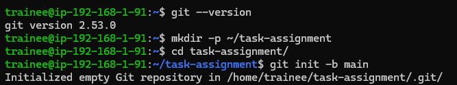

**26. Checking Docker and Docker Compose.**

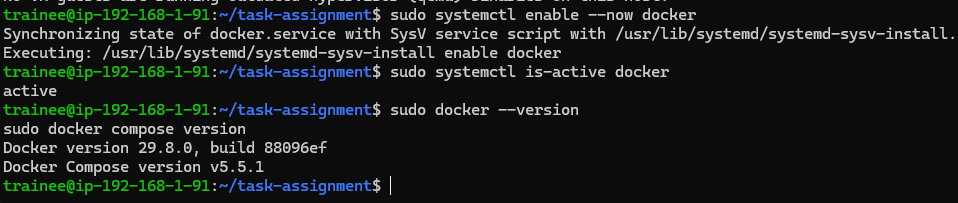

**27. Checking the three services with docker compose ps; the database was healthy.**

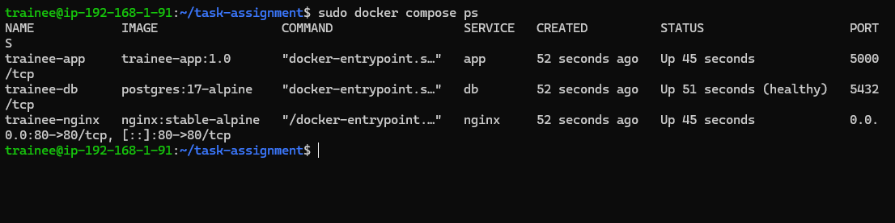

**28. Getting HTTP 200 through Nginx with curl.**

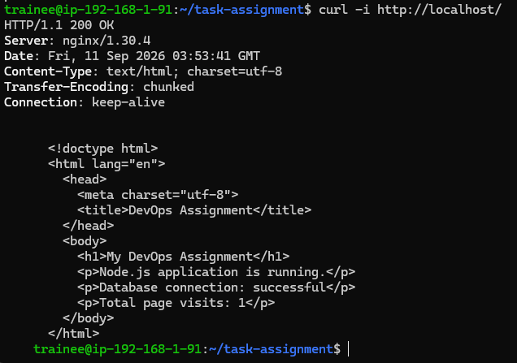

**29. Opening my app in the browser and seeing the visit count.**

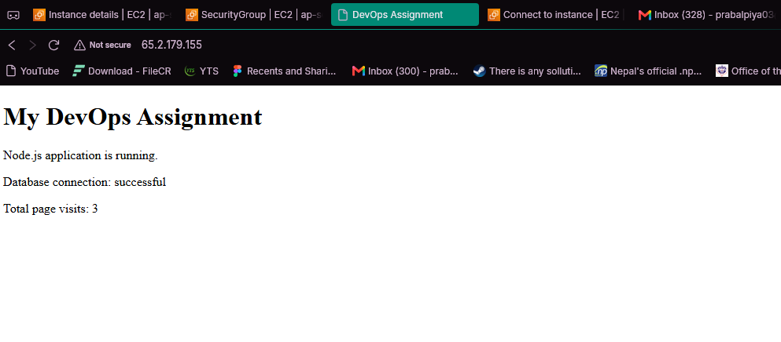

To check persistence, open the page once, then record the database count:

```bash
docker exec trainee-db psql -U trainee -d trainee_db -c 'SELECT COUNT(*) FROM visits;'
docker compose down
docker compose up -d
```

## Task 3: Health check and cron

The health script checks CPU, RAM, root disk usage, Docker, and the application container. It prints a warning and adds a timestamped entry to `/var/log/infra_health.log` when disk usage is above 85% or the application is stopped.

```bash
bash -n scripts/infra_health_check.sh
bash -n scripts/db_backup.sh
bash -n scripts/collect_metrics.sh
sudo mkdir -p /opt/scripts
sudo install -m 755 scripts/*.sh /opt/scripts/
sudo /opt/scripts/infra_health_check.sh
```

The warning log is created when a warning first occurs.

**30. Running the health check and testing a stopped-app warning.**

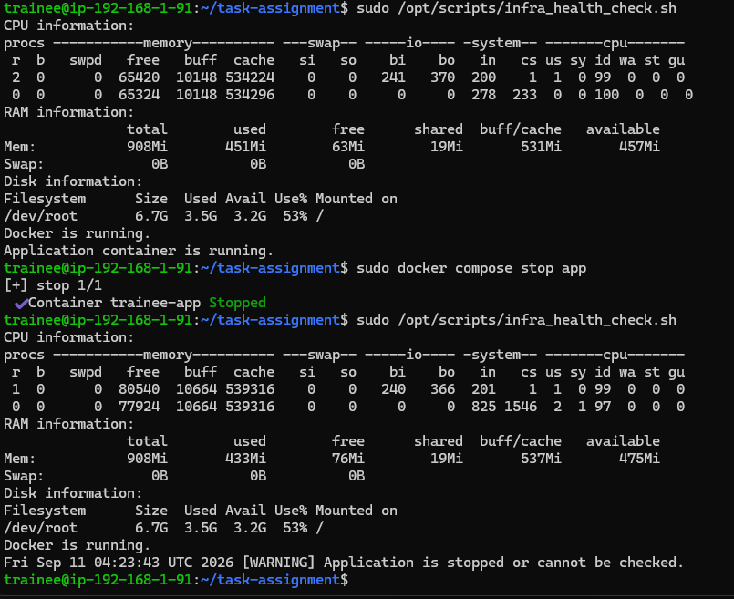

**31. Checking the timestamped warning log.**

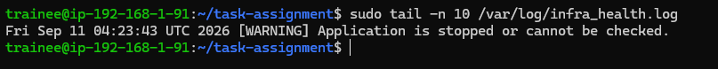

**32. Checking the health check output from cron.**

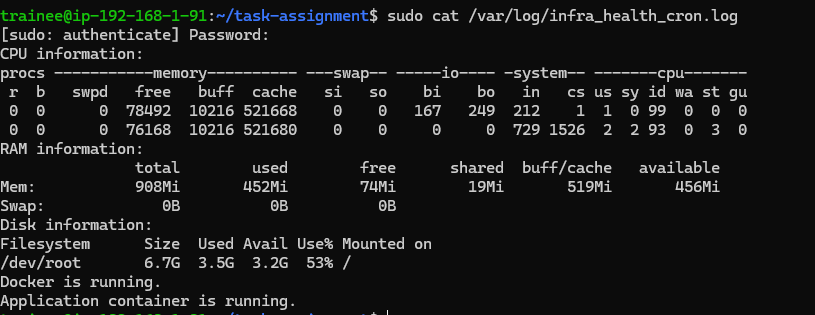

### Run every 15 minutes

```bash
sudo install -m 644 configs/infra-health /etc/cron.d/infra-health
sudo systemctl enable --now cron
cat /etc/cron.d/infra-health
```

The cron entry is:

```cron
*/15 * * * * root /opt/scripts/infra_health_check.sh > /var/log/infra_health_cron.log 2>&1
```

It runs at minutes 00, 15, 30, and 45. After the next scheduled run, check:

```bash
sudo cat /var/log/infra_health_cron.log
```

## Task 4: Backups, restoration, and monitoring

### Database backup

```bash
sudo /opt/scripts/db_backup.sh
sudo ls -lh /var/backups/db/
```

The script uses `pg_dump` and gzip. The backup filename is `db_backup_YYYYMMDD.sql.gz`, using the server's date. This is a gzip-compressed SQL dump, not a tar archive.

Only one compressed backup is kept per day. Another run that day skips the existing backup. New backups have owner-only permissions.

### Restore and verify a backup

Choose an existing backup and replace `YYYYMMDD` with its date. Restore into a new test database so the live data is preserved:

```bash
backup=/var/backups/db/db_backup_YYYYMMDD.sql.gz
sudo gzip -t "$backup"
```

Continue only if the archive check succeeds:

```bash
docker exec trainee-db createdb -U trainee trainee_restore_test
set -o pipefail
sudo gzip -dc "$backup" | docker exec -i trainee-db psql -v ON_ERROR_STOP=1 -U trainee -d trainee_restore_test
docker exec trainee-db psql -U trainee -d trainee_restore_test -c 'SELECT COUNT(*) FROM visits;'
```

**33. Finding my compressed database backup.**

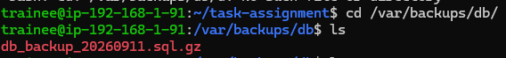

**34. Backing up and restoring into a test database.**

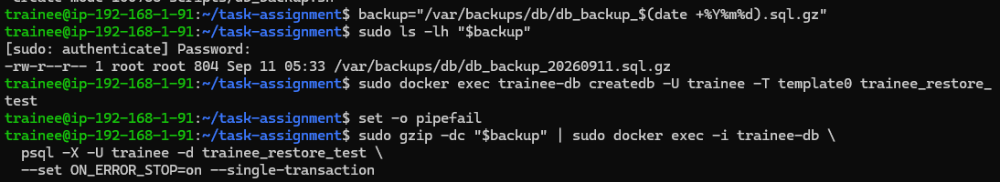

**35. Checking the original and restored databases; both showed 9 rows.**

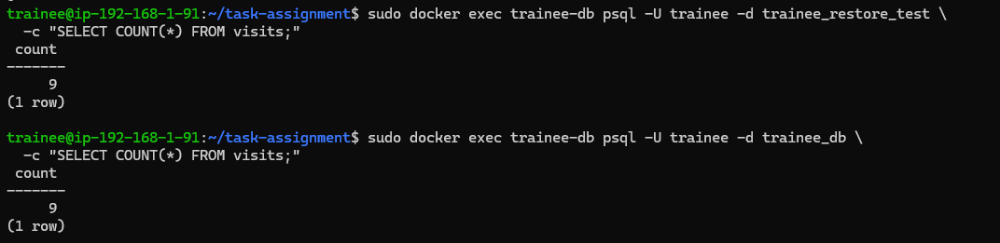

### Basic monitoring

The metrics script collects CPU, RAM, disk, and container resource information. Nginx serves the latest text file at `http://127.0.0.1:8080/metrics` on EC2.

```bash
sudo /opt/scripts/collect_metrics.sh
sudo install -m 644 configs/infra-metrics /etc/cron.d/infra-metrics
curl http://127.0.0.1:8080/metrics
```

The cron job updates the file every minute. Check the `Collected at` timestamp to see whether it is fresh.
To view it from the laptop, run this in WSL and leave the terminal open:

```bash
ssh -N -L 8080:127.0.0.1:8080 -p 2222 -i task.pem trainee@SERVER_PUBLIC_IP
```

Open `http://localhost:8080/metrics` in the laptop browser. The SSH tunnel provides access without opening port 8080 in the security group.

**36. Checking the collected metrics file.**

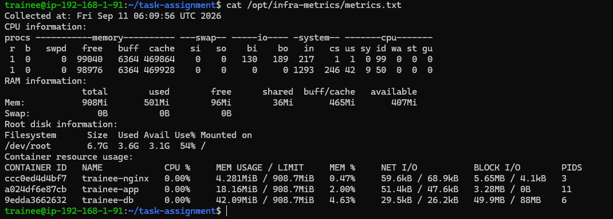

**37. Getting HTTP 200 from the local metrics endpoint.**

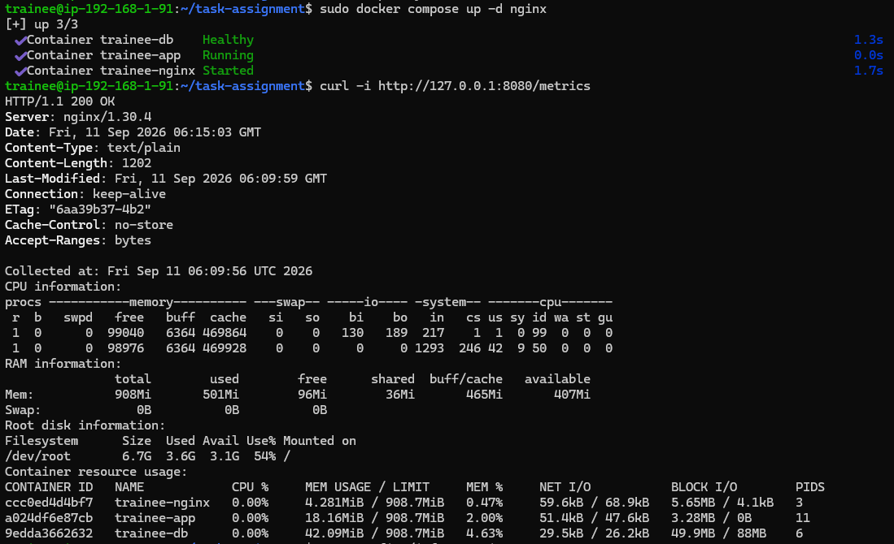

**38. Viewing metrics in my laptop browser.**

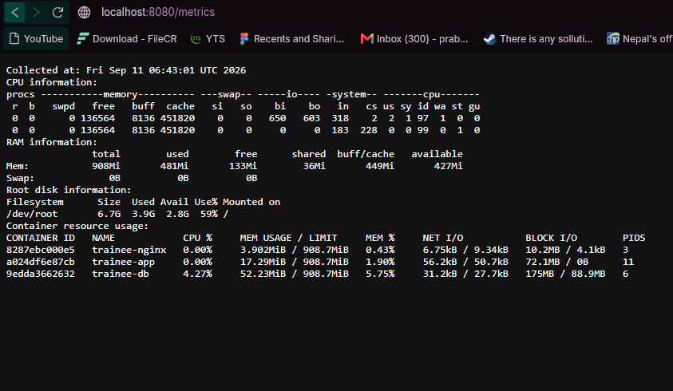

**39. Opening the SSH tunnel from WSL. This earlier screenshot uses ubuntu; the runbook command uses trainee.**

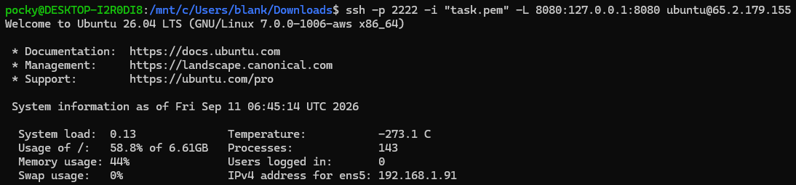

## Teardown

Stop the stack while keeping the database volume:

```bash
cd ~/task-assignment
docker compose down
```

For full cleanup, remove the cron jobs:

```bash
sudo rm -f /etc/cron.d/infra-health /etc/cron.d/infra-metrics
```

To delete the database volume as well, run the following:

```bash
docker compose down -v
```

If EC2 instance is also to be deleted:

1. Be in the same region as the instance
2. Terminate the EC2 instance
3. Delete subnets and custom route table
4. Detach internetgateway from VPC and then delete it
5. Delete security groups
6. Delete the VPC

[ Note: I used AI to help troubleshoot errors and understand unfamiliar steps, including cron jobs, a custom metrics endpoint through Nginx, and parts of the Bash scripts. ]
